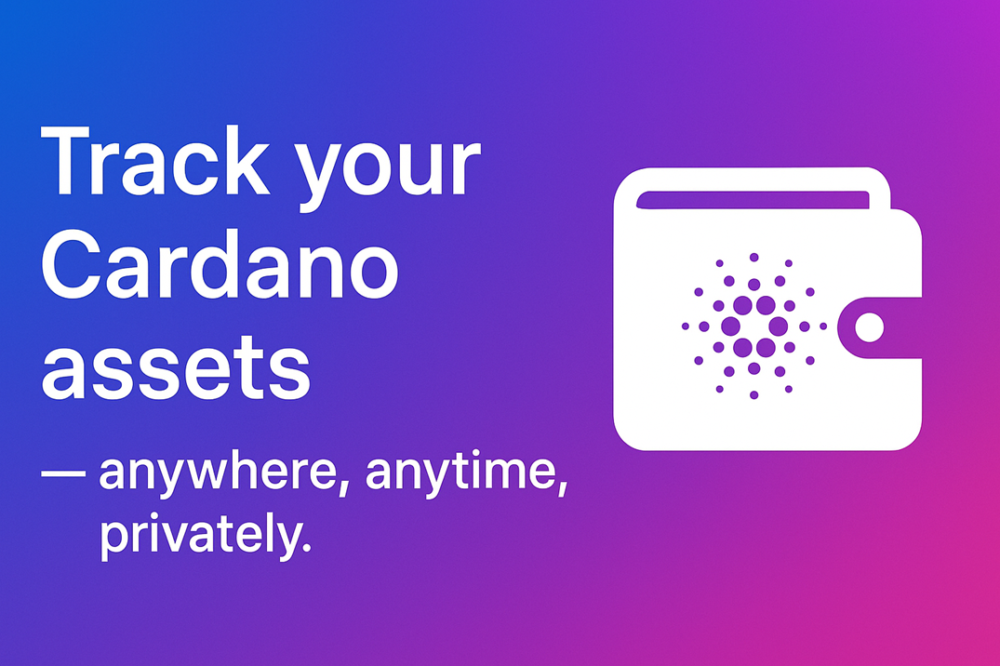

# Introdution

### 📬 Cardano Asset Tracker

#### Get alerts via **Telegram & Gmail** — privately, securely, and 0 cost.

***

### 🔧 What’s Included?

* 📄 **Documentation + Tutorial Videos**\
  A detailed, step-by-step guide to creating your own custom Asset tracker tool to meet your specific needs.
* 🔗 **Free API Integration**\
  Instructions on how to use public APIs (Koios, Blockfrost, Cardanoscan, etc.) to check Cardano asset balances.
* 💬 **Telegram & Gmail Alerts**\
  Set up automatic alerts when the assets in your wallet change — via Telegram bot and/or email. **(Gmail API)**.
* 💻 **Bot Source Code – Fully Documented**\
  The Python or Javascript source code is easy to understand and customize, with detailed comments on each line.

### 🛡️ Why Use This?

* **No cost at all**
* **No third-party wallet exposure** – your wallet address stays private.
* **Self-hosted, self-controlled** – you own your data and alerts.
* Perfect for serious Cardano holders who want **high security** without relying on external platforms.

<figure><figcaption></figcaption></figure>
