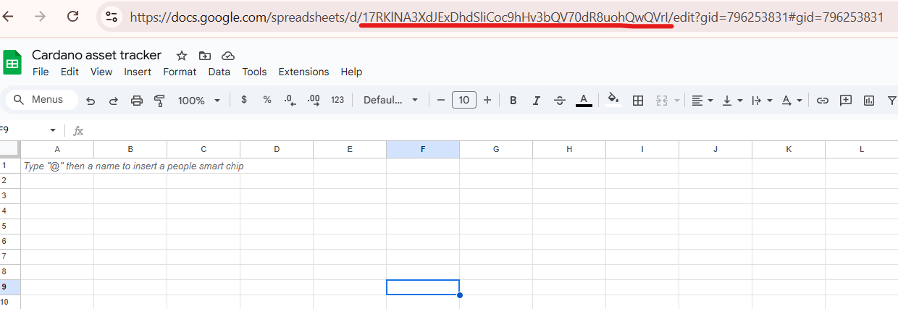

# Database

The **Database Layer** is where your tracker stores, organizes, and retrieves all processed data.\
In this personal Cardano asset tracker, we use **Google Sheets** as the main database — simple, flexible, and completely free.

***

### 🗄️ Google Sheets as Database

Google Sheets works as both a **data storage layer** and a **visual dashboard**.\
It allows you to easily monitor asset changes, record inputs, and generate reports — all in one place.

***

### 🔧 **Setup Steps**

1. **Create a new Google Sheet**
   * Go to Google Sheets
   * Name it something like `Cardano_Asset_Tracker`&#x20;
   * Set up your sheet sharing level (Recommend: It should be private if you don't have any plan to share your tracker with anyone)
2. **Prepare multiple tabs (worksheets)**\
   You can organize your tracker by separating each function into a dedicated tab.\
   For example:
   * **📈 ADA\_Changes** — tracks ADA balance changes, used for daily monitoring.
   * **🪙 Token\_Overview** — stores all token balances from wallet addresses.
   * **📊 Daily\_Report** — aggregates data for daily or weekly summaries.
   * **🔄 Input\_Log** — logs all incoming data requests or triggers from the output modules (Telegram Bot, Email, etc.).

_Note: You can also name it whatever you like if you are only building the tool for your own personal use._


3. **Get your Sheet ID**

*   Copy the unique ID from your sheet URL:

    ```
    https://docs.google.com/spreadsheets/d/<YOUR_SHEET_ID>/edit
    ```

<figure><figcaption></figcaption></figure>


4. **Access your sheet via Google Apps Script**

* Open your Sheet → `Extensions` → `Apps Script`
*   Example:

    ```js
    function logADAChange(timestamp, wallet, balance) {
      const sheet = SpreadsheetApp.getActivesheet("<YOUR_SHEET_ID>").getSheetByName("ADA_Changes");
      sheet.appendRow([timestamp, wallet, balance]);
    }
    ```


5. **Integrate with your tracker logic**

* When your hosting logic (Python / Node.js / Google Apps Script) fetches new data via API (Koios or Blockfrost), it calls this function to store it in the correct tab.

***

### 💡 **Tips for Organizing Tabs**

| Tab Name        | Purpose                               | Example Columns                                     |
| --------------- | ------------------------------------- | --------------------------------------------------- |
| ADA\_Changes    | Record ADA fluctuation per wallet     | Time \| Wallet \| Old Balance \| New Balance \| Δ   |
| Token\_Overview | Track all token holdings              | Policy ID \| Token Name \| Quantity \| Last Updated |
| Daily\_Report   | Store daily summarized data           | Date \| Total ADA \| Total Tokens \| Wallet Count   |
| Input\_Log      | Record system triggers or user inputs | Time \| Source \| Type \| Request                   |

<figure><figcaption></figcaption></figure>

***

### ✅ **Why Use Google Sheets**

* **Free and easy to set up** — no database configuration needed
* **Real-time collaboration** — view and edit from anywhere
* **Visual data inspection** — ideal for personal dashboards
* **Native integration** — easily automated via Google Apps Script
