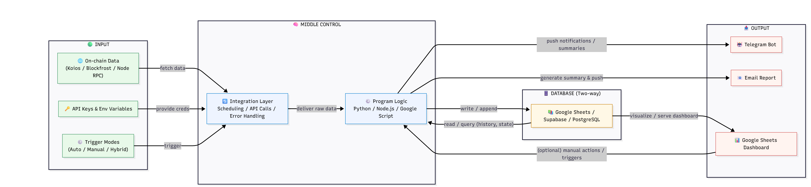
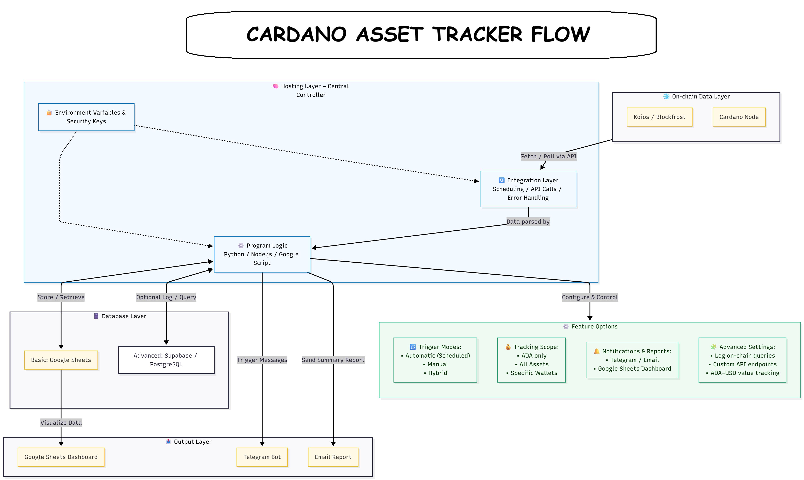
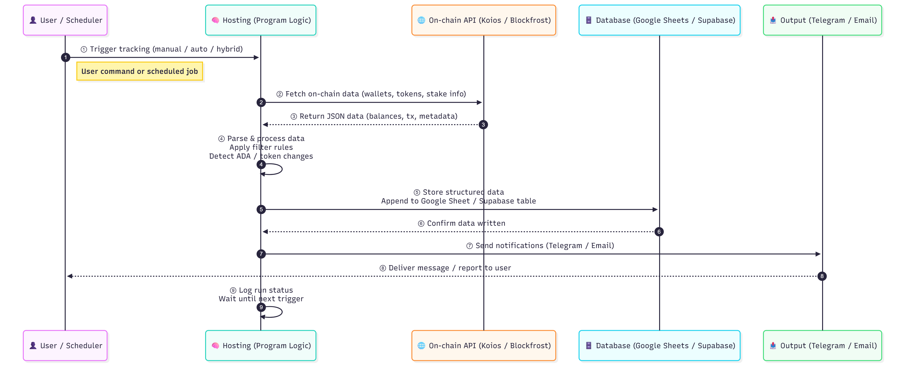

# Overview

The **Cardano Asset Tracker** is an automation framework designed to monitor, analyze, and report on on-chain activities for Cardano wallets.\
It connects blockchain data sources such as **Koios** and **Blockfrost** with a flexible hosting and data pipeline, enabling both **manual** and **automated** tracking.

This system is divided into **five functional layers**, each playing a specific role in the data lifecycle:

<figure><figcaption>
Simple flow
</figcaption></figure>

<figure><figcaption>
Tracker full flow
</figcaption></figure>

***

#### 🌐 **1. On-chain Data Layer**

This layer interacts directly with the Cardano blockchain through:

* **Koios** and **Blockfrost APIs** for querying wallet balances, native tokens, and staking info.
* **Cardano Node RPC** (optional) for low-level data access or validation.

Its main task is to fetch and provide verified blockchain data to the system in real time.

***

#### 🧠 **2. Hosting Layer – Central Controller**

This is the **core brain** of the tracker.\
It hosts the program logic and controls scheduling, API requests, and error handling.\
Typical environments include:

* **Google Cloud**, **Google Apps Script**, or **Contabo VPS** for continuous uptime.
* Environment variables and secrets (API keys, wallet addresses) are securely managed here.

***

#### ⚙️ **3. Program Logic**

Built using **Python**, **Node.js**, or **Google Script**, this component:

* Parses and processes on-chain data.
* Applies logic for price checks, balance changes, or custom tracking thresholds.
* Routes data to the database or output channels depending on system configuration.

***

#### 🗄️ **4. Database Layer**

Stores and organizes all fetched data.\
It supports both lightweight and scalable options:

* **Google Sheets** (default) for small-scale data tracking and visualization.
* **Supabase / PostgreSQL** (optional) for advanced users or large data workloads.

***

#### 📤 **5. Output Layer**

Delivers information to users in real time:

* **Telegram Bot** for instant alerts or manual commands (`/refresh`, `/status`, etc.).
* **Email Reports** for daily or weekly summaries.
* **Google Sheets Dashboard** for visualizing token balances and historical changes.

***

#### ⚙️ **Feature Options**

The tracker supports flexible customization through:

* **Trigger Modes:** Auto (scheduled), manual, or hybrid.
* **Tracking Scope:** ADA-only, all assets, or specific wallets.
* **Advanced Features:** On-chain logs, custom APIs, ADA–USD price tracking.

***

#### 🧩 **System Flow Summary**

<figure><figcaption></figcaption></figure>

1. User triggers the tracker (manual/auto/hybrid)
2. Fetch blockchain data from **Koios** or **Blockfrost**.
3. Process it through **Hosting and Program Logic**.
4. Store structured data into **Google Sheets / Database**.
5. Notify users via **Telegram / Email / Dashboard**.
6. Repeat automatically or on demand.

***

#### ✅ **Purpose**

The goal of this architecture is to provide a **modular, low-maintenance monitoring tool** that helps Cardano builders, DAO operators, and investors keep track of wallet activity — without relying on centralized dashboards.
